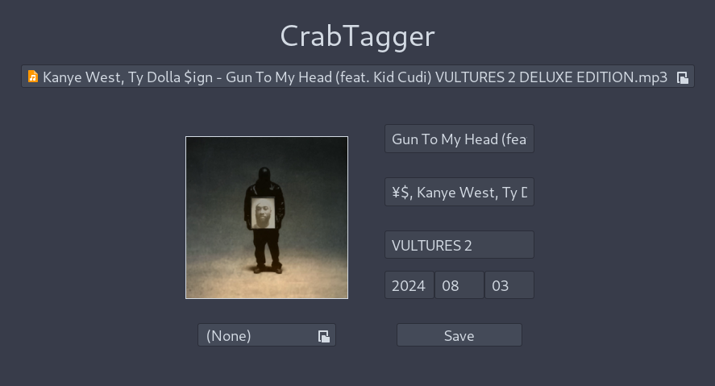

# crabtagger

`crabtagger` is a music metadata editor written in Rust using GTK3 as the GUI framework.

It currently supports setting the title, album name, artist(s) name, and cover image of audio files of various formats.

Example:

